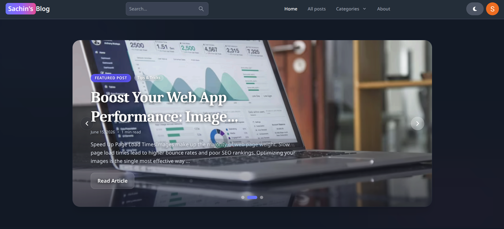
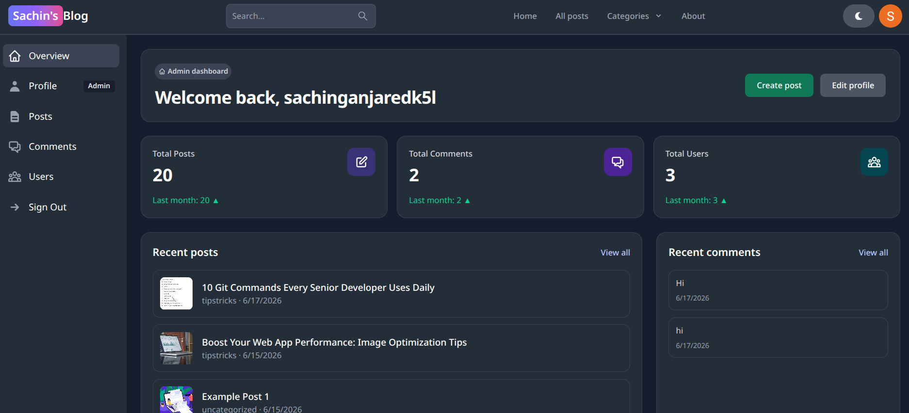
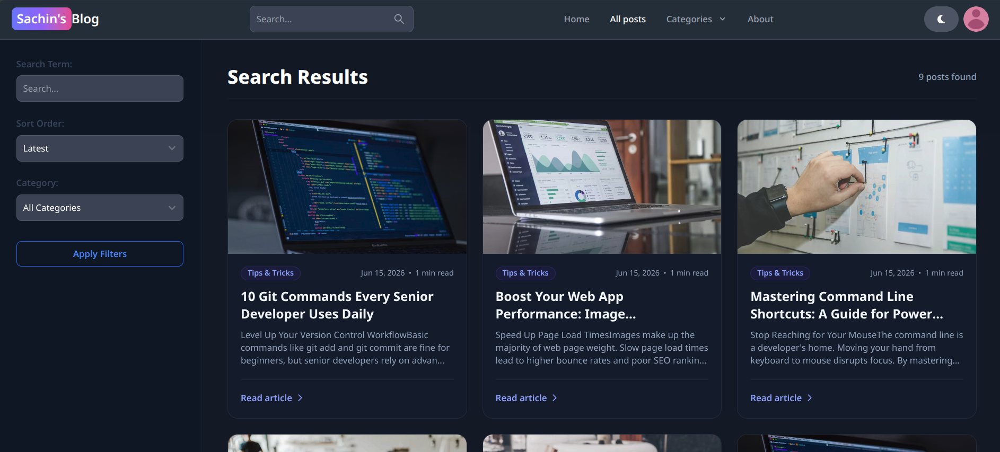

# MERN Blog Platform

A full-stack blogging platform built with MongoDB, Express, React, and Node.js. It includes user authentication, post creation and editing, comments, likes, profile updates, an admin dashboard, Google sign-in, and image uploads via Cloudinary/Firebase support in the frontend.

## Live Demo

Deployed on Render: [https://sachinsblog.onrender.com/](https://sachinsblog.onrender.com/)

## Screenshots

### Homepage


### Dashboard


### All Posts


## Tech Stack

- Frontend: React, Vite, Redux Toolkit, Tailwind CSS, Flowbite React
- Backend: Node.js, Express
- Database: MongoDB with Mongoose
- Authentication: JWT, Firebase Google sign-in
- Media Uploads: Cloudinary

## Features

- User sign up, sign in, sign out, and Google authentication
- Create, update, delete, and browse blog posts
- Comment system with likes and deletion
- Search posts by query, category, or slug
- Admin dashboard for managing users, posts, and comments
- Responsive UI with light/dark theme support

## Project Structure

- `api/` - Express backend, routes, controllers, models, and utilities
- `client/` - React frontend built with Vite

## Prerequisites

- Node.js
- npm
- MongoDB database connection string
- Firebase project for Google sign-in
- Cloudinary account for image uploads

## Local Setup

### 1. Clone the repository

```bash
git clone https://github.com/sachin-ganjare/blog-platform-mern.git
cd blog-platform-mern
```

### 2. Install dependencies

Install the root/backend dependencies:

```bash
npm install
```

Install the client dependencies:

```bash
npm install --prefix client
```

### 3. Configure environment variables

Create a `.env` file in the project root:

```env
MONGO=your_mongodb_connection_string
JWT_SECRET=your_jwt_secret
```

Create a `client/.env` file:

```env
VITE_FIREBASE_API_KEY=your_firebase_api_key
VITE_CLOUDINARY_CLOUD_NAME=your_cloudinary_cloud_name
VITE_CLOUDINARY_UPLOAD_PRESET=your_cloudinary_upload_preset
VITE_CLOUDINARY_FOLDER=profile-pictures
```

### 4. Run the app in development

Open two terminals:

Backend:

```bash
npm run dev
```

Frontend:

```bash
npm run dev --prefix client
```

By default, the backend runs on `http://localhost:3000`, and the Vite frontend runs on `http://localhost:5173`.

## Production Build

To build the frontend and prepare the app for production:

```bash
npm run build
```

This installs dependencies if needed and builds the client into `client/dist`, which is served by the Express app.

To start the production server locally:

```bash
npm start
```

## Notes

- The frontend uses a Vite proxy for `/api` requests, so the backend should be running on port `3000` during local development.

